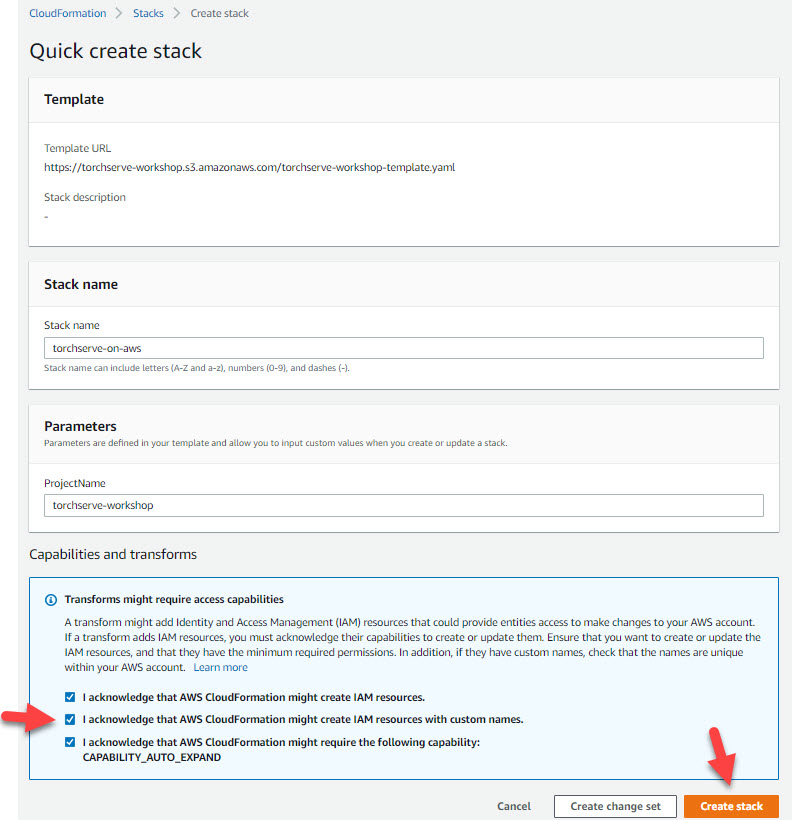
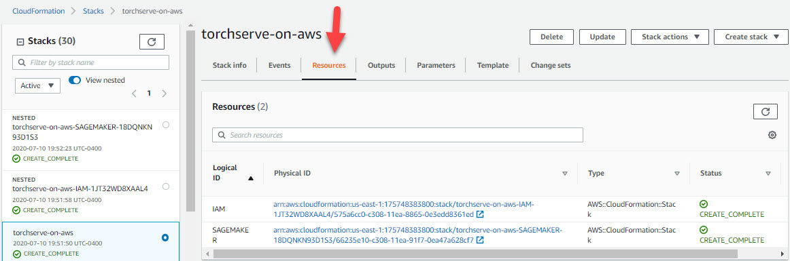
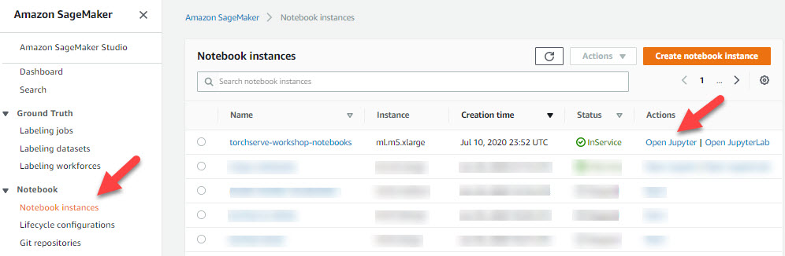

# TorchServe On AWS Workshop
This workshop is geared towards anyone that is looking to leverage machine learning and learn how PyTorch can accelerate the path from research prototyping to a production deployment. Whether you are an aspiring PyTorch enthusiast, just stopping by out of curiosity, or working at a company that uses PyTorch today, this workshop will make it easy to build and serve models in production on AWS. This workshop is centered around using TorchServe on AWS and is complimented with foundational PyTorch knowledge and hands on labs.

### Begin With CloudFormation Stack Deployment and Notebook Verification in 5 Easy Steps

*You are going to create an IAM Role and deploy a 'ml.m5.xlarge' SageMaker instance. You can see the current pricing **[here](https://aws.amazon.com/sagemaker/pricing/).***

<strong>Note: </strong> The following launch templates use a CPU based instance. If you wish to run the notebook that requires a GPU based instance, see the section below "TorchServe using a GPU instance".

**[1]** To begin, sign in to your the AWS console. You will be launching a CloudFormation (CF) tempalte into one of the below regions.

**[2]** Next, click ONLY ONE icon below to launch a CF Template in your preferred region:

|Launch Template| Region   |
|:--------------|:---------|
||**N.Virginia** (us-east-1)|
||**Ireland** (eu-west-1)|
||**Singapore** (ap-southeast-1)|

**[3]** Check the three acknowledgement boxes and the orange 'Create Stack' button at the bottom as seen below:

*Your CloudFormation stack will take about 5 minutes to complete the creation of the Amazon SageMaker notebook instance and it's IAM role.*

**[4]** Once complete, ensure that you see you should see output similar to the following screen:

**[5]** Finally, head over to the **[Amazon SageMaker Console](https://console.aws.amazon.com/sagemaker/home?region=us-east-1#/notebook-instances)** and click on Notebook Instances from the left navigation pane. Identify your newly created notebook and the click the 'Open Jupyter' link as shown below:

*You can now proceed to the "[Main Lab] Getting Started With TorchServe".*

### Interested In Seeing the CF Template Code? ###
- **[Launched CloudFormation Template](https://torchserve-workshop.s3.amazonaws.com/torchserve-workshop-template.yaml)** - names your stack, declares your instance details type, and calls the below nested templates.
- **[IAM Template](https://torchserve-workshop.s3.amazonaws.com/iam_template.yaml)** - used to create the Amazon SageMaker Notebook IAM Role
- **[SageMaker Template](https://torchserve-workshop.s3.amazonaws.com/sagemaker_template.yaml)** - associates the workshops git repository

